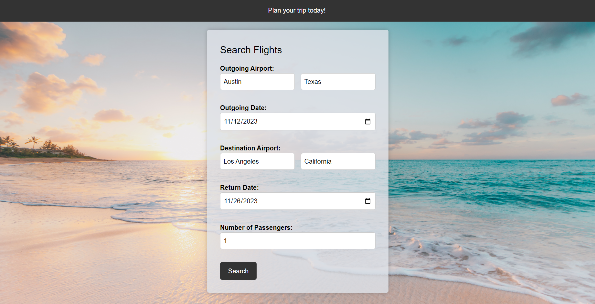

# Travel-Planner

## Description
This project was to help us learn how to work together in a small team and build an advanced website. This website uses multiple api calls to return data that is used for calculations and displays, and uses Tailwind to help with the CSS styling. We learned how to make the website change between html pages, call certain functions only when a specific webpage was displayed, and how to use localStorage to save data that can be used in different pages.

## User Story

```
AS A traveler
I WANT to find the best deals for flights and hotels for my vacation 
SO THAT I can plan my trip accordingly
```

## Usage
To start planning your trip, click the get started button. Fill out the information form (make sure that the names of the cities or states are not abbreviated), then click the search button. After loading (may take up to 10 seconds) the results, scroll until you find the flight that you want to select. After selecting the flight, you can either input a radius that will show hotels within that radius of your destination airport, or you can skip the search and proceed to the travel overview page.

## Screenshots



## Live Application
The link to the live application of the webpage is: https://gyerkes.github.io/travel-planner/

## Source Code
The source code is located at the website https://github.com/gyerkes/travel-planner
